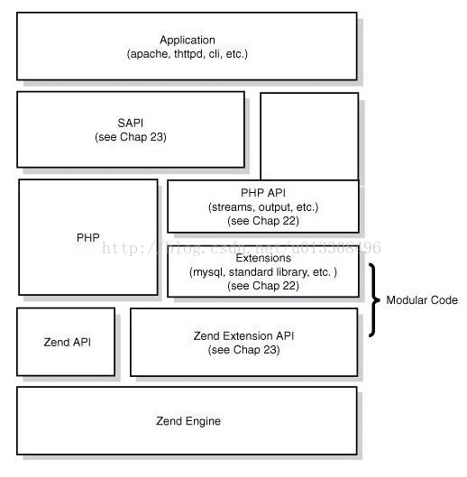

# php一些基本原理

---

### php设计理念及特点

1. 多进程模型：每个请求都有互不干涉，这样保证了一个请求挂了不会对全局的服务造成影响

2. 弱类型语言
3. 引擎（zend）+组件（ext） 模式降低了内部耦合
4. 中间层（sapi）隔绝web server 与 PHP

### php四层体系



从下到上是php的四层体系：
1. Zend引擎
2. Extensions：围绕Zend引擎，extensions通过组件式的方式提供各种基础服务。
3. Sapi：Sapi全称Server Application Programming Interface，也就是服务端应用编程接口，Sapi通过一系列钩子函数，使得PHP可以和外围交互数据，这是PHP非常优雅和成功的设计，通过sapi成功的将PHP本身和上层应用解耦隔离，PHP可以不再考虑如何针对不同应用进行兼容，而应用本身也可以针对自己的特点实现不同的处理方式。
4. 上层应用

### Sapi
1. apache2handler：以apache作为webserver，采用mod_PHP模式运行时的处理方式
2. cgi：这是webserver和PHP交互的另一种方式，也就是fastcgi协议，也是异步webserver所唯一支持的方式
3. cli：命令行调用的应用模式

### PHP执行流程&opcode

1. Scanning ，先将php代码转换为语言片段（Tokens）
2. Parsing ，将Tokens转换成简单的表达式
3. Compilation ，将表达式编译成Opcode
4. Execution ，顺次执行Opcode，从而实现php脚本功能

**OpCode**：
  Opecode是php程序执行的最基本单位。一个opcode由两个参数（op1,op2），返回值和处理函数组成，PHP程序最终被翻译为义组opcode处理函数顺序执行
  >常见的几个处理函数：
  ```php
  ZEND_ASSIGN_SPEC_CV_CV_HANDLER : 变量分配 （$a=$b）
  ZEND_DO_FCALL_BY_NAME_SPEC_HANDLER：函数调用
  ZEND_CONCAT_SPEC_CV_CV_HANDLER：字符串拼接
  $a.$bZEND_ADD_SPEC_CV_CONST_HANDLER: 加法运算
  $a+2ZEND_IS_EQUAL_SPEC_CV_CONST：判断相等
  $a==1ZEND_IS_IDENTICAL_SPEC_CV_CONST：判断相等 $a===1
  ```

  ### HashTable-核心数据结构


HashTable是Zend的核心数据结构，在PHP中几乎被用来实现所有常见功能。如：php中的数组，zend内部如函数符号表，全局变量也是给予HashTable实现的。HashTable具有如下特点：
1. 支持典型的key->value查询
2. 可以当作数组使用
3. 添加和删除节点的复杂度都是O(1)
4. key支持混合类型，同时存在关联数组和索引数组
5. value支持混合类型
6. 支持线性遍历，如foreach

### PHP变量
PHP的变量在底层都是同一种结构zval，zval主要由三部分组成：
1. type ：制定了变量所述的类型
2. refcount&is_ref ：用来实现引用计数
3. value ：核心部分，存储了变量的实际数据

zvalue是用来保存的一个变量的实际数据，因为要存储多种类型，所以zvalue是一个union，也由此实现弱类型。

**引用计数**：在内存回收，字符串操作等地方使用。zval的引用计数使用ref_count和is_ref实现，通过引用计数，可以多个变量共享一份数据，避免频繁拷贝带来的大量消耗。

**Tips**
1. 整数、浮点数是PHP中的基础类型之一，也是一个简单型变量。对于整数和浮点数，在zvalue中直接存储对应的值。其类型分别是long和double。
2. 在进行赋值操作时，zend将变量指向相同的zval同时ref_count++，在unset操作时，对应的ref_count-1。只有ref_count减为0时才会真正执行销毁操作。如果是引用赋值，则zend会修改is_ref为1。
3. 在PHP中，如果整数范围越界了怎么办？这种情况下会自动转换为double类型，这个一定要小心，很多trick都是由此产生。
